# Swatches 1-60

<figure><figcaption></figcaption></figure> <figure><figcaption></figcaption></figure> <figure><figcaption></figcaption></figure> <figure><figcaption></figcaption></figure> <figure><figcaption></figcaption></figure> <figure><figcaption></figcaption></figure>

<figure><figcaption></figcaption></figure> <figure><figcaption></figcaption></figure> <figure><figcaption></figcaption></figure> <figure><figcaption></figcaption></figure> <figure><figcaption></figcaption></figure> <figure><figcaption></figcaption></figure>

<figure><figcaption></figcaption></figure> <figure><figcaption></figcaption></figure> <figure><figcaption></figcaption></figure> <figure><figcaption></figcaption></figure> <figure><figcaption></figcaption></figure> <figure><figcaption></figcaption></figure>

<figure><figcaption></figcaption></figure> <figure><figcaption></figcaption></figure> <figure><figcaption></figcaption></figure> <figure><figcaption></figcaption></figure> <figure><figcaption></figcaption></figure> <figure><figcaption></figcaption></figure>

<figure><figcaption></figcaption></figure> <figure>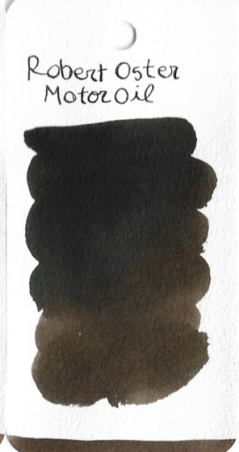<figcaption></figcaption></figure> <figure>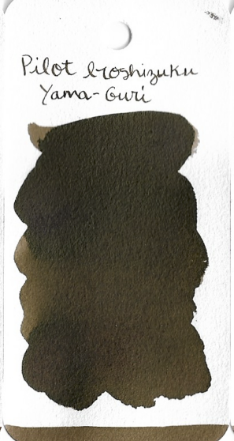<figcaption></figcaption></figure> <figure>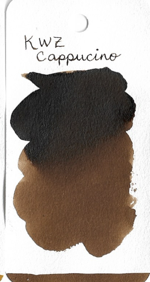<figcaption></figcaption></figure> <figure>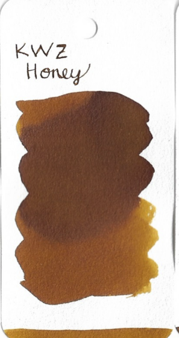<figcaption></figcaption></figure> <figure>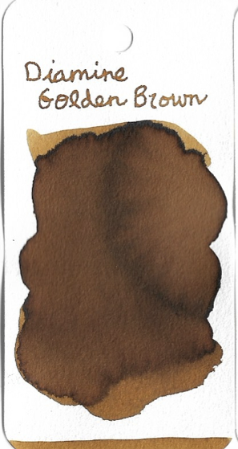<figcaption></figcaption></figure>

<figure>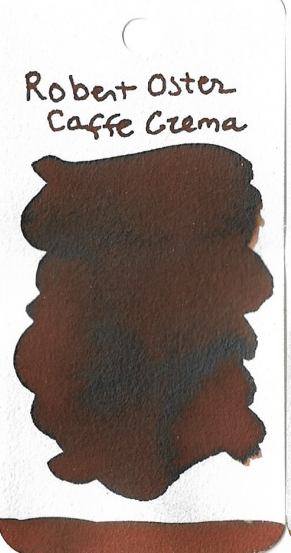<figcaption></figcaption></figure> <figure>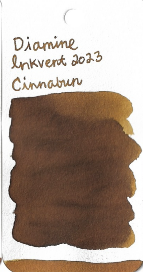<figcaption></figcaption></figure> <figure>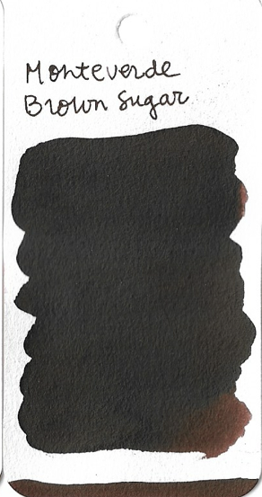<figcaption></figcaption></figure> <figure>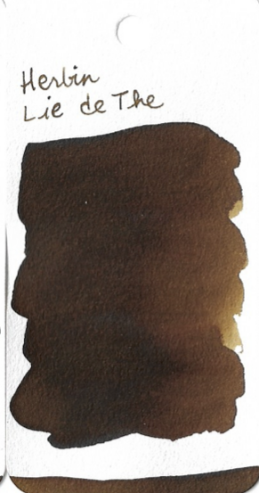<figcaption></figcaption></figure> <figure>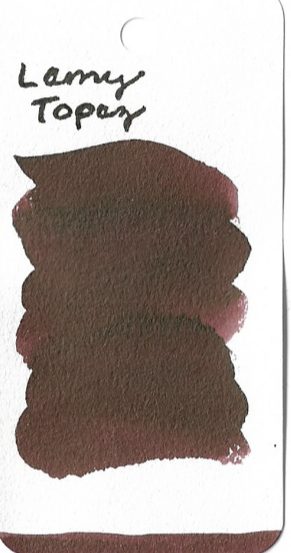<figcaption></figcaption></figure> <figure>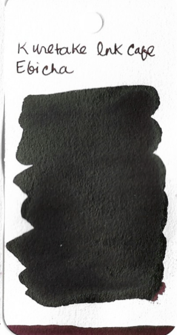<figcaption></figcaption></figure>

<figure>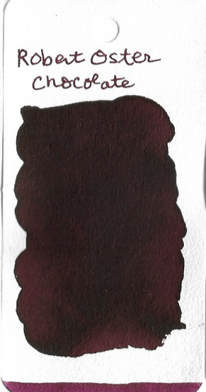<figcaption></figcaption></figure> <figure>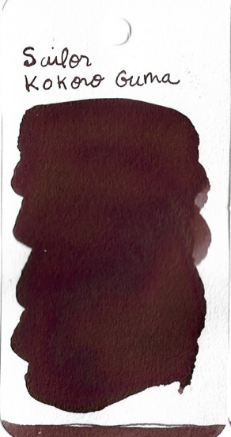<figcaption></figcaption></figure> <figure>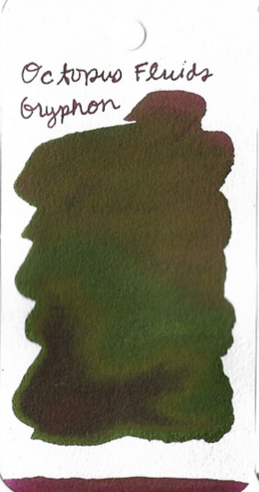<figcaption></figcaption></figure> <figure>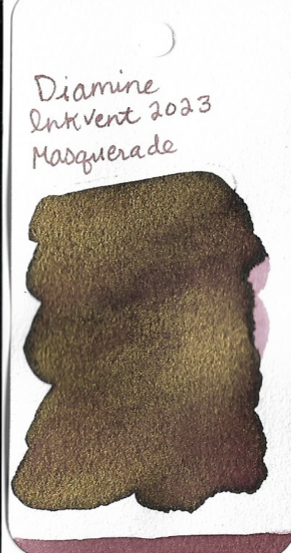<figcaption></figcaption></figure> <figure>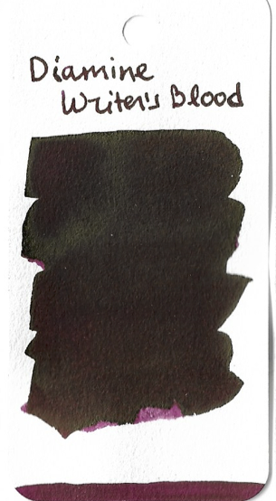<figcaption></figcaption></figure> <figure>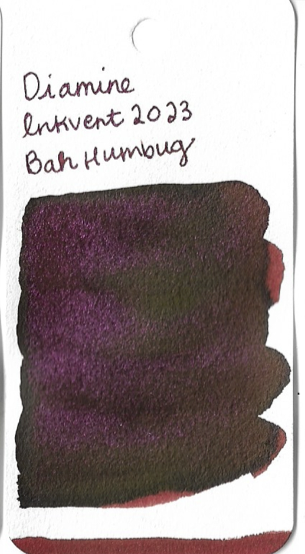<figcaption></figcaption></figure>

<figure>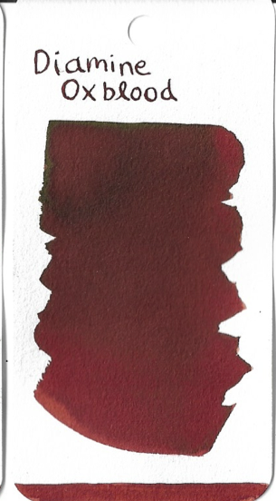<figcaption></figcaption></figure> <figure>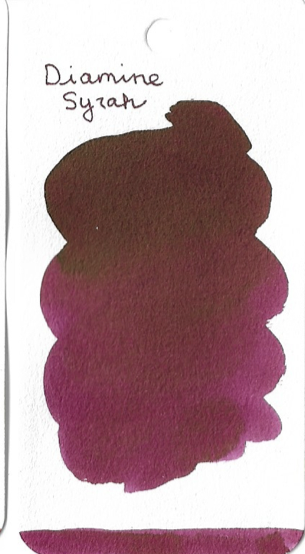<figcaption></figcaption></figure> <figure>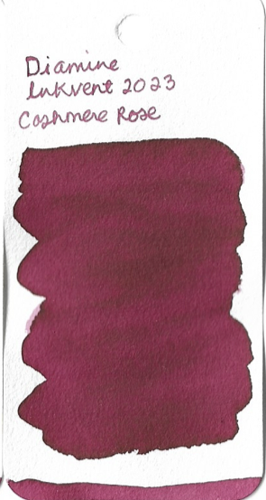<figcaption></figcaption></figure> <figure>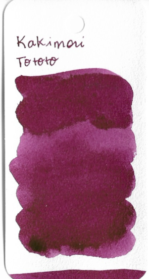<figcaption></figcaption></figure> <figure>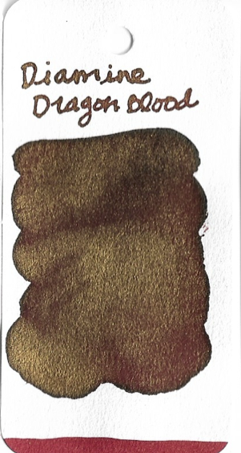<figcaption></figcaption></figure> <figure>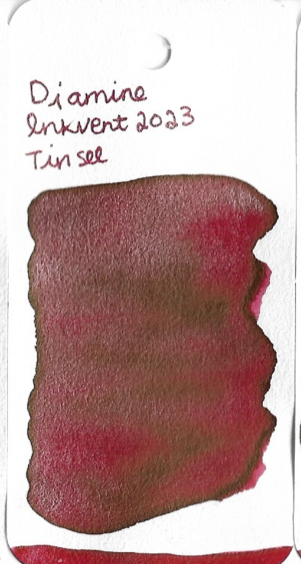<figcaption></figcaption></figure>

<figure>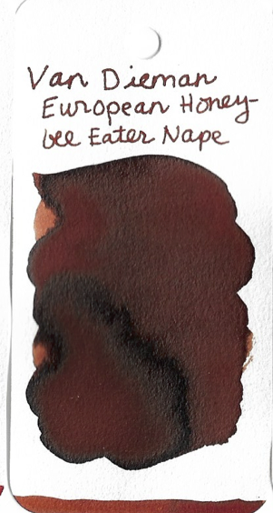<figcaption></figcaption></figure> <figure>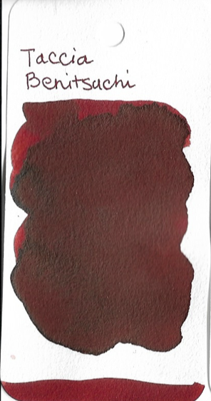<figcaption></figcaption></figure> <figure>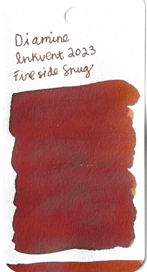<figcaption></figcaption></figure> <figure>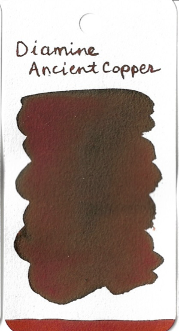<figcaption></figcaption></figure> <figure>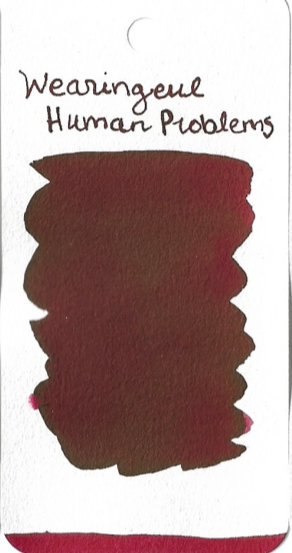<figcaption></figcaption></figure> <figure>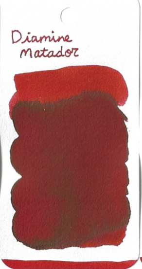<figcaption></figcaption></figure>

<figure>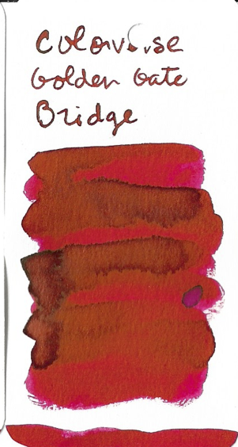<figcaption></figcaption></figure> <figure>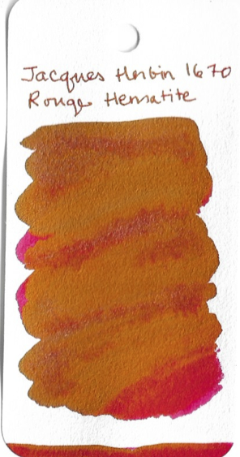<figcaption></figcaption></figure> <figure>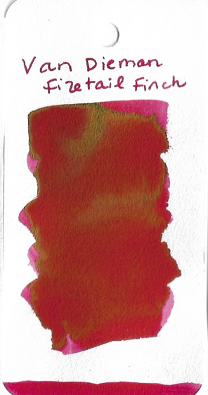<figcaption></figcaption></figure> <figure>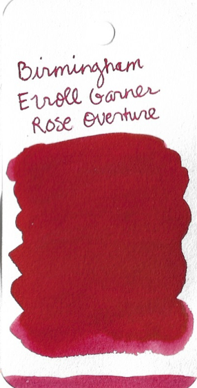<figcaption></figcaption></figure> <figure>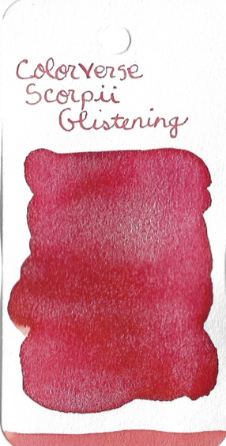<figcaption></figcaption></figure> <figure>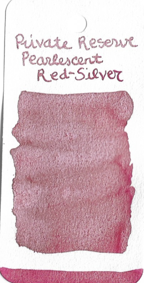<figcaption></figcaption></figure>

